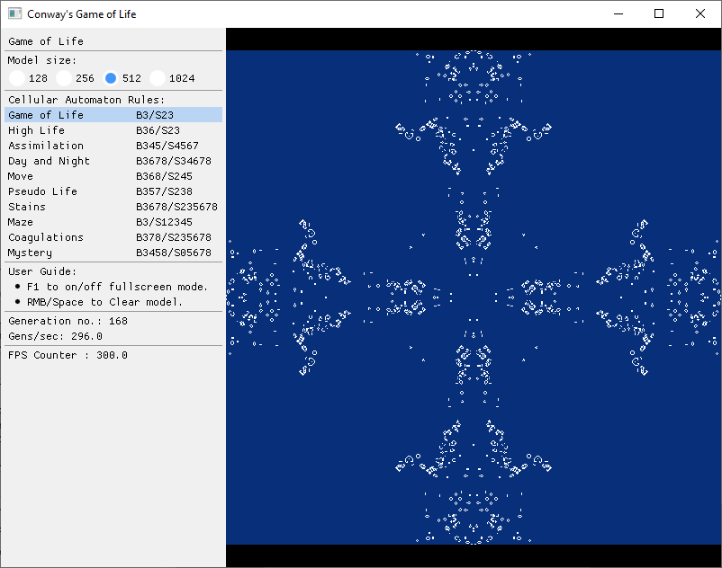
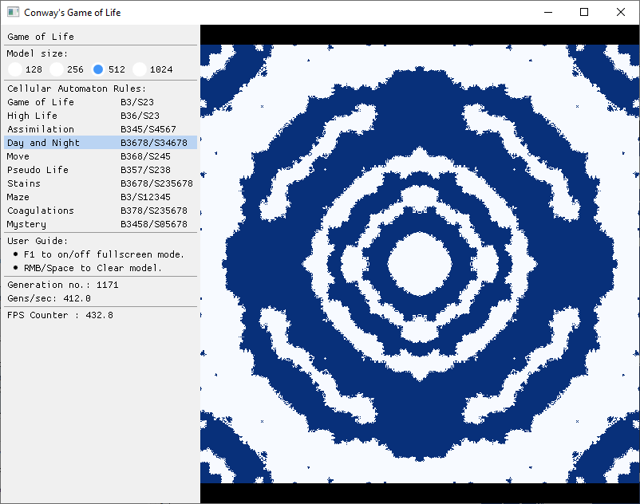
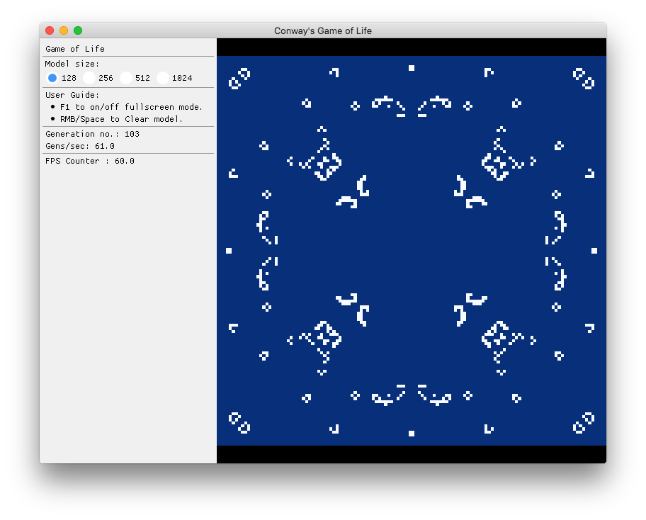

# Conway's Game of Life on GPU using OpenGL

## Introduction

This project uses GPU to evaluate cellular automata of [Conway's Game of Life](https://en.wikipedia.org/wiki/Conway%27s_Game_of_Life). The calculations of the next generaion of the cellular autamata are made with the fragment shader and the evaluation result is caught with frame buffers.


## Screenshots






## Dependencies

Generating build files for your OS and build system requires CMake.
Most of the dependencies are bundled with the repository as git submodules.
This includes:

* [glad](https://github.com/Dav1dde/glad) - OpenGL Function Loader.
* [glfw](https://github.com/glfw/glfw) - Windowing and Input.
* [glm](https://github.com/g-truc/glm) - OpenGL Mathematics.
* [plog](https://github.com/SergiusTheBest/plog) - Logging library.
* [imgui](https://github.com/ocornut/imgui) - UI library.


## Building for Linux

### Dependencies

The following instructions apply to:

* Ubuntu 20.04, 18.04, 16.04
* Debian 9 and higher

```
sudo apt-get install -y \
    build-essential \
    cmake \
    xorg-dev \
    libgl1-mesa-dev \
    libfreetype6-dev
```

The following instructions apply to:

* Fedora 22 and higher

```
sudo dnf install -y \
    gcc gcc-c++ make \
    cmake \
    mesa-libGL-devel \
    libXrandr-devel \
    libXinerama-devel \
    libXcursor-devel \
    libXi-devel \
    freetype-devel
```

* CentOS 7 and higher

```
sudo yum install -y \
    gcc gcc-c++ make \
    cmake \
    mesa-libGL-devel \
    libXrandr-devel \
    libXinerama-devel \
    libXcursor-devel \
    libXi-devel \
    freetype-devel
```

### Cloning Repository
```
git clone --recursive https://github.com/Postrediori/GameOfLifeGpu.git
cd GameOfLifeGpu
```

Cloning the repository requires passing the `--recursive` flag to load Git submodules.

### Building Project

The program is built with the commands below. CMake requires the directory 
with the main project's `CMakeLists.txt` file as an argument. Then the CMake 
creates the build files for the GNU make which build an executable.

```
mkdir build && cd build
cmake .. -DCMAKE_BUILD_TYPE=Release
make
make install
```

After the successful build the binary `GameOfLifeGpu` will end up in `<source dir>/bundle/GameOfLifeGpu/`.


## Building for macOS

### Dependencies

You’ll need to download and install the following to build the project:
* Xcode and the Xcode command line tools
* [CMake](https://cmake.org/) (e.g. via homebrew `brew install cmake`)

### Cloning Repository
```
git clone --recursive https://github.com/Postrediori/GameOfLifeGpu.git
cd GameOfLifeGpu
```

### Using Building
Generate makefiles for the build:

```
mkdir build && cd build
cmake .. -DCMAKE_OSX_ARCHITECTURES=x86_64 -DCMAKE_BUILD_TYPE=Release
make
make install
```

An `GameOfLifeGpu` application bundle will now be present under `<Source directory>/bundle/GameOfLifeGpu`.


## Controls

* **F1** &ndash; Toggle fullscreen mode.
* **RMB** and **Space** &ndash; Restart simulation.
* **1..4** &ndash; Change model size (and restart simulation).


## Links

* [Conway's Game of Life](https://en.wikipedia.org/wiki/Conway%27s_Game_of_Life)
* [Life-like cellular automaton](https://en.wikipedia.org/wiki/Life-like_cellular_automaton)


## TODO

* [x] Build instructions
* [ ] Optimization of generation algorithm (mark cells that were changed or may be changed)
* [ ] Capture screenshots&animation
* [ ] Edit cellular automata rules
* [ ] Cellular automata with more cell states (e.g. predator-pray)
