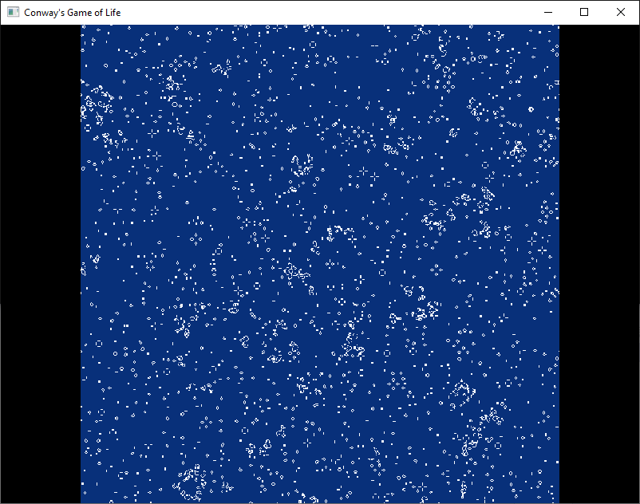

# Conway's Game of Life on GPU using OpenGL
## Introduction
This project uses GPU to evaluate Conay's Game of Life.
The calculations of the next generaion of the cellular
autamata are made with the fragment shader and the evaluation
result is caught with frame buffers.

